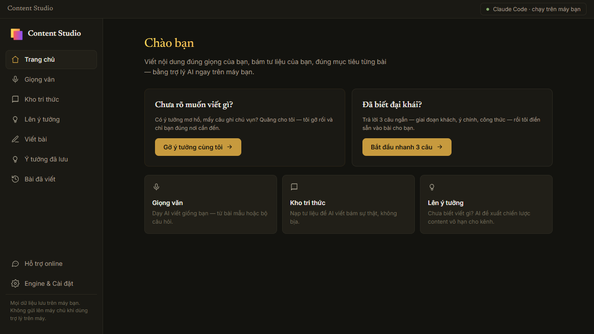
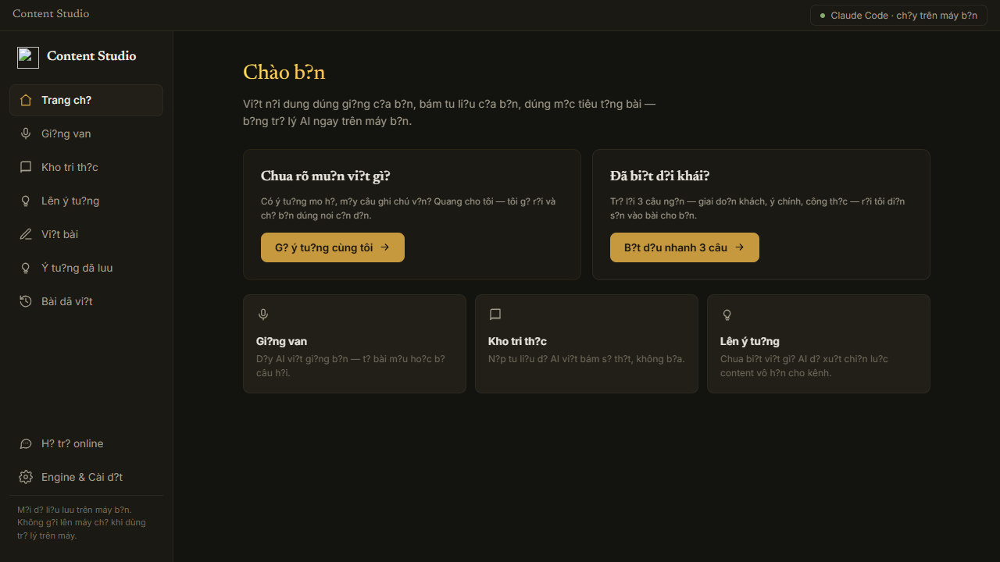
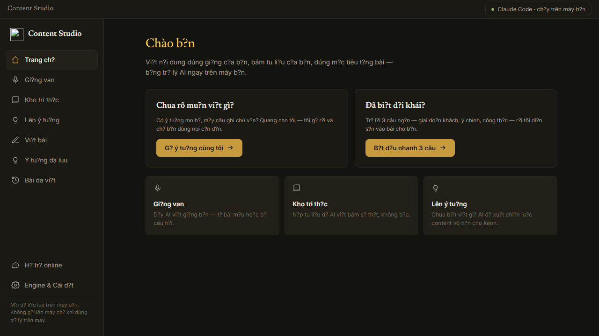
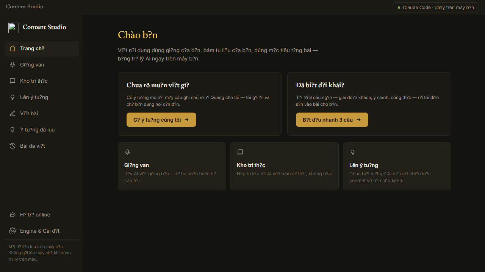
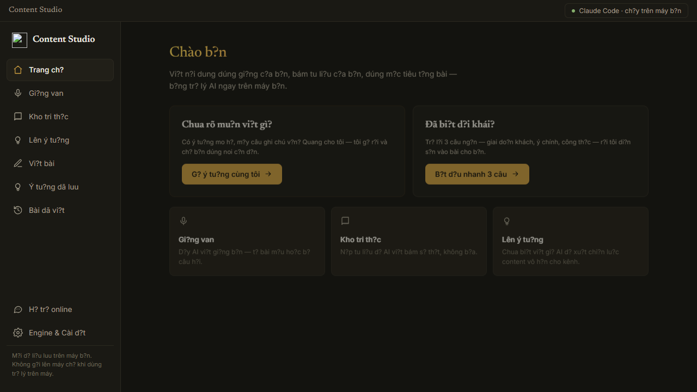

# Content Studio

  

  

  <strong>An AI-powered workspace that writes in your true voice, grounded in your knowledge.</strong>

  Content Studio is a local-first platform designed for creators and marketing teams
  who are tired of generic AI output and want to scale their unique voice.

  
  
  
  

  <strong>Read in English</strong> |
  <a href="README.vi.md"><strong>Đọc bằng tiếng Việt</strong></a>

  <a href="https://content-studio-landing-dkh.pages.dev/"><strong>Landing Page</strong></a>
  |
  <a href="SUPPORT.md"><strong>Support</strong></a>
  |
  <a href="docs/FAQ.md"><strong>FAQ</strong></a>

## The Big Shift

Most AI writing tools give you generic, robotic content because they don't know *how* you write or *what* you know.

Content Studio changes that loop.

It learns your distinct writing style from past samples, lets you build a localized knowledge base to ensure factual accuracy, and gives you a structured studio to generate endless ideas and drafts. 

The "wow" is not just that AI writes for you.  
The "wow" is that it sounds exactly like you, using your actual facts, without the typical "AI-isms".

## Why It Feels Different

1. **Teach** it your voice (tone, phrasing, structure).
2. **Collect** your knowledge (documents, links, PDFs).
3. **Generate** ideas and write high-converting content effortlessly.

This repository is a public product-information and support hub for the commercial Windows desktop app by AlphaTech. It does not contain the application source code.

## What You Get

- `🗣️` Learn your distinct writing voice from past articles or through an interactive survey
- `📂` Centralized Knowledge Base: Ingest files and links so AI writes based on facts, not hallucinations
- `💡` Endless Idea Generation: AI proposes strategic content ideas tailored to your audience
- `✍️` Writing Studio: A guided step-by-step flow to turn ideas into finished drafts
- `🔐` Local-First: Run Claude Code or use your own API keys directly on your machine

## Visual Tour

  
  

  
  

## Who It Is For

- `✍️` Content Creators who want to scale their output without losing their personal touch
- `🧑‍💼` Marketing Teams needing to produce consistent, brand-aligned content across channels
- `📊` Founders and Experts who want to turn their raw knowledge into polished articles quickly

## What Content Studio Does

- Analyzes your previous writings to extract a "Voice DNA" (tone, banned words, signature phrases)
- Ingests varied source materials (text, URLs, files) into a structured local library
- Brainstorms marketing angles and content pillars based on your niche
- Guides you through a structured drafting process (Idea -> Context -> Draft -> Polish)
- Outputs final content ready for publishing

## Product Boundaries

### Shipped now

- Windows desktop app
- Local engine support (Claude CLI, API keys for OpenAI/DeepSeek)
- Voice training module
- Idea generation engine
- Step-by-step Writing Studio

### Important caveats

- Content Studio is a commercial closed-source application.
- It is designed to run locally on your machine for maximum privacy, but API calls to LLM providers are made based on your settings.
- macOS is not officially supported yet.

## Start Here

- `🌐` Landing page: https://content-studio-landing-dkh.pages.dev/
- `🛟` Support guide: [SUPPORT.md](SUPPORT.md)
- `❓` FAQ: [docs/FAQ.md](docs/FAQ.md)
- `🗺️` Roadmap: [docs/ROADMAP.md](docs/ROADMAP.md)

## Support

- Email: `alphatech.digitolead@gmail.com`
- Zalo: `https://zalo.me/0908695494`

## Closed-Source Notice

Content Studio is a commercial closed-source desktop product by AlphaTech.

This repository exists to:
- explain the product
- show current capabilities
- publish screenshots and public docs
- provide support and security contact paths

It does not include application source code or binaries.
